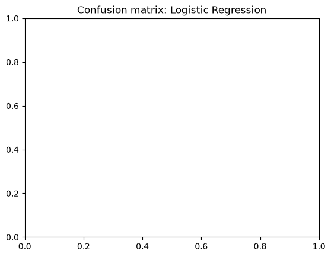
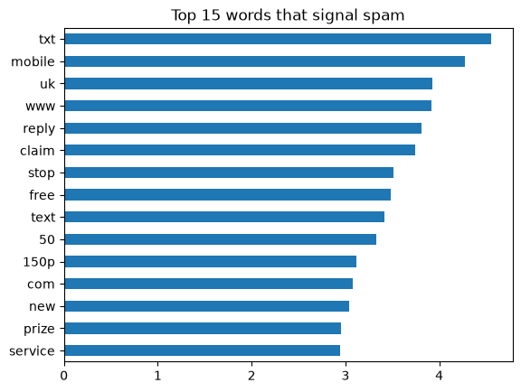

# SMS Spam Classifier

A machine learning model that detects spam SMS messages, served through a REST API.
I built this after working on SMS messaging infrastructure at Termii, where spam
filtering is a real problem at scale.

## Dataset
[SMS Spam Collection](https://www.kaggle.com/datasets/uciml/sms-spam-collection-dataset): 5169 messages after removing
403 duplicates. Only ~13% are spam, so the classes are imbalanced.

## Approach
- Removed duplicate messages to prevent data leakage between training and test sets
- TF-IDF text features, built inside a scikit-learn Pipeline
- Compared Multinomial Naive Bayes and Logistic Regression (with class weighting)
  against a majority-class baseline
- Evaluated with precision, recall and F1, because accuracy is misleading on
  imbalanced data

## Results
	model	               accuracy	  precision	recall	f1
0	Baseline (always ham)  0.873	  0.000	    0.000	0.000
1	Naive Bayes	           0.966	  0.990	    0.740	0.847
2	Logistic Regression	   0.976	  0.921	    0.885	0.903

The baseline gets ~87% accuracy while catching zero spam, which is why F1 was
the main metric.

## API
Run `uvicorn app.main:app --reload` and open http://127.0.0.1:8000/docs.
Example response from POST /predict:
{"label": "spam", "spam_probability": 0.97}

## How to run
pip install -r requirements.txt
Download spam.csv into data/, run the notebook, then start the API.

## What I'd do next
Try a transformer model (e.g. DistilBERT), tune the decision threshold to trade
precision for recall, and containerise the API with Docker.